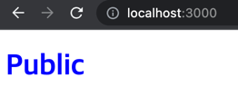
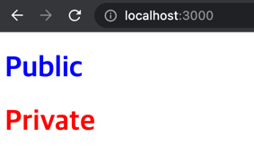
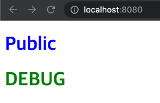
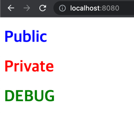

# vue-conditional-compile-sample
배포되는 특정 환경에 따라 코드 단위의 조건부 컴파일을 하는 샘플 프로젝트

* 빌드 옵션에 따라 특정 주석이 명시된 코드가 컴파일될 수 있다.
* 주석 규칙에 대한 자세한 내용은 라이브러리 [js-conditional-compile-loader](https://github.com/hzsrc/js-conditional-compile-loader) 참고

## 사전 준비

### serve 설치
```shell
npm install -g serve
```

### public 빌드 실행
```shell
# 프로젝트 폴더로 이동
# 빌드
npm run build

# 빌드 실행
serve -s dist
```



### private 빌드 실행
```shell
# 빌드
npm run build --private

# 빌드 실행
serve -s dist
```


### 로컬 개발(debug) 모드에서 public 실행
```shell
npm run serve
```


### 로컬 개발(debug) 모드에서 private 실행
```shell
npm run serve --private
```
